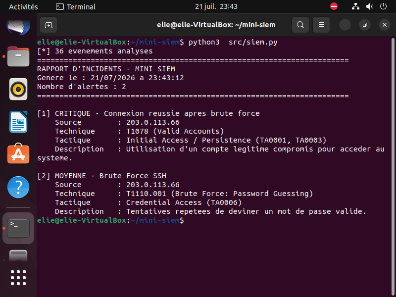

# Mini-SIEM — SSH Log Analyzer with MITRE ATT&CK Mapping

A lightweight Security Information and Event Management (SIEM) tool written in pure Python.
It parses SSH authentication logs, detects intrusion patterns through temporal correlation,
and maps every alert to the MITRE ATT&CK framework.


---

## Overview

Brute-force attacks against SSH are among the most common intrusion attempts on
internet-facing servers. A single failed login means nothing; fifteen failures in
under a minute followed by a success means a compromised account.

This project implements that reasoning in code: it does not just count events,
it correlates them to characterise an incident.

---

## Features

- **Log parsing** — regex-based extraction of structured events from raw `auth.log` files
- **Brute-force detection** — sliding-window analysis (configurable threshold and time window)
- **Alert correlation** — flags successful logins originating from IPs already involved in a brute-force attempt
- **MITRE ATT&CK mapping** — every alert is enriched with its technique ID, tactic and severity
- **Reporting** — human-readable text report sorted by severity, plus machine-readable JSON export
- **Log generator** — produces realistic test data containing a known attack scenario
- **Zero dependencies** — standard library only

---

## Architecture

```
mini-siem/
├── src/
│   ├── generate_logs.py    # Test data generator (normal traffic + attack scenario)
│   ├── parser.py           # Raw log lines -> structured events (regex)
│   ├── detection.py        # Detection rules and alert correlation
│   ├── mitre.py            # MITRE ATT&CK knowledge base and enrichment
│   ├── report.py           # Severity sorting, text and JSON output
│   └── siem.py             # Entry point / orchestration
├── logs/                   # Input logs (git-ignored)
├── reports/                # Generated reports (git-ignored)
└── exemple_rapport.txt     # Sample output

```
    

Each module has a single responsibility. Detection logic is separated from the
ATT&CK knowledge base so new rules can be added without touching the engine.

---

## Installation

```bash
git clone https://github.com/eliemehintookou/mini-siem.git
cd mini-siem
```

No packages to install — Python 3.10 or later is the only requirement.

## Usage

Generate a test log file containing a simulated attack:

```bash
python3 src/generate_logs.py
```

Run the analysis:

```bash
python3 src/siem.py
```

Or analyse any other SSH log file:

```bash
python3 src/siem.py /var/log/auth.log
```

Results are printed to the console and written to `reports/rapport.txt`
and `reports/alertes.json`.

---

## Sample output

```
======================================================================
RAPPORT D'INCIDENTS - MINI SIEM
Genere le : 21/07/2026 a 03:25:09
Nombre d'alertes : 2
======================================================================

[1] CRITIQUE - Connexion reussie apres brute force
    Source        : 203.0.113.66
    Technique     : T1078 (Valid Accounts)
    Tactique      : Initial Access / Persistence (TA0001, TA0003)
    Description   : Utilisation d'un compte legitime compromis pour acceder au systeme.

[2] MOYENNE - Brute Force SSH
    Source        : 203.0.113.66
    Technique     : T1110.001 (Brute Force: Password Guessing)
    Tactique      : Credential Access (TA0006)
    Description   : Tentatives repetees de deviner un mot de passe valide.
```

Alerts are sorted by severity so the most critical incident always appears first.

---

## Detection rules

| Rule | Logic | ATT&CK technique | Severity |
|------|-------|------------------|----------|
| Brute Force SSH | 5+ failed authentications from one IP within a 5-minute sliding window | [T1110.001](https://attack.mitre.org/techniques/T1110/001/) — Password Guessing | MEDIUM |
| Successful login after brute force | Successful authentication from an IP already flagged by the rule above | [T1078](https://attack.mitre.org/techniques/T1078/) — Valid Accounts | CRITICAL |

Thresholds are defined as constants in `src/detection.py`:

```python
SEUIL_ECHECS = 5      # failed attempts required to trigger
FENETRE_MINUTES = 5   # sliding window size
```

### Why the sliding window matters

For each failed attempt, the engine looks back over the configured window and
counts how many other failures fall inside it, keeping the densest window found.
This measures the *rate* of failures rather than their total, which is what
actually distinguishes an automated attack from a forgetful user.

---

## Limitations

This is a learning project with a deliberately narrow scope. Known limitations:

- **SSH only** — no support for web, firewall or Windows Event logs
- **No year in syslog timestamps** — the current year is assumed, which breaks across year boundaries
- **Batch processing** — the tool analyses a file, it does not tail logs in real time
- **In-memory** — the whole log file is loaded at once; not suitable for large volumes
- **No allowlist** — legitimate automation (backup scripts, monitoring probes) will produce false positives
- **No distributed detection** — a slow attack spread across many source IPs would go unnoticed

## Roadmap

- [ ] Password spraying detection (T1110.003) — one password tried against many accounts
- [ ] Configurable rules via a YAML file instead of hardcoded constants
- [ ] Real-time monitoring mode (`tail -f` style)
- [ ] IP allowlist to reduce false positives
- [ ] Additional log sources (Apache, nginx, firewall)
- [ ] Unit tests with `pytest`

---

## Context

Built from scratch as a personal project to explore detection engineering.
It complements earlier offensive work (an authorised penetration test on
Metasploitable 2) by approaching the same events from the defender's side:
what the attack looks like in the logs, and how to catch it.

## License

MIT

## Author

**Elie MEHINTO** — M1 Cybersecurity & Networks student
[LinkedIn](http://bit.ly/4nk6Yz2) · [GitHub](https://bit.ly/4u5TGJ4)
